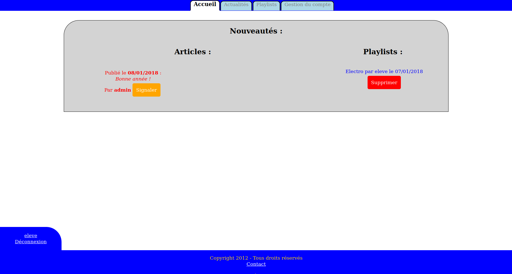
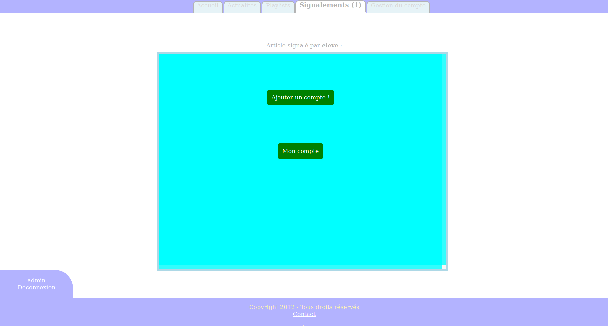

# OneClass

Oneclass is a small project I had when I was young. This is a micro social network dedicated for one student class. The code is ugly, but sometimes code just has a sentimental value.

## To run it

`cd` to the repo directory and then

``` bash
docker compose up -d
```

Wait for the database to initialize, then navigate to [localhost](http://localhost)

**Creds**

|UserName|Password|
|---|---|
|admin|admin|
|eleve|eleve|

## Screenshots







